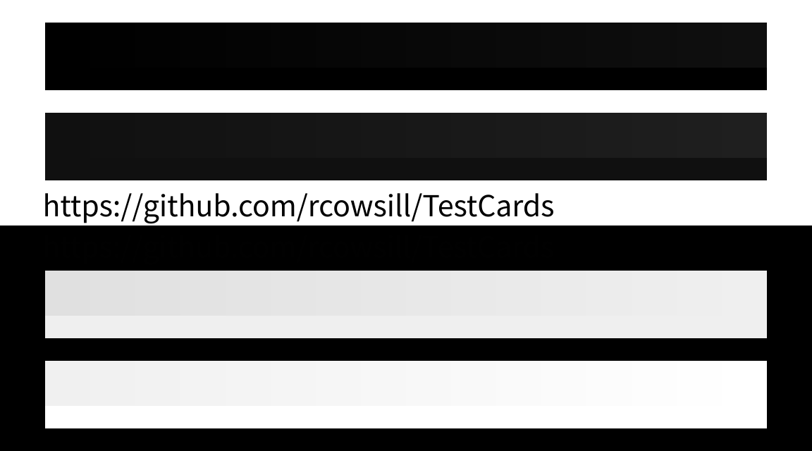

# Test Cards

## Full/Limited RGB Range

If test strips A and D both appear to be solid blocks (no gradient), then your graphics card's RGB range setting doesn't match your display's.

Click on the image below to view it at full-size:

All four test strips have a gradient of 16 shades running from left to right. Along the lower edge is a solid band of the leftmost shade in the gradient. The boundary between the gradient and the solid band should be visible on all four test strips, at least on the right side. Adjusting your viewing angle may make the boundary more pronounced.

If you have multiple monitors, view the test image on each one. The default range setting can vary depending on the connection type (HDMI, DisplayPort etc).
